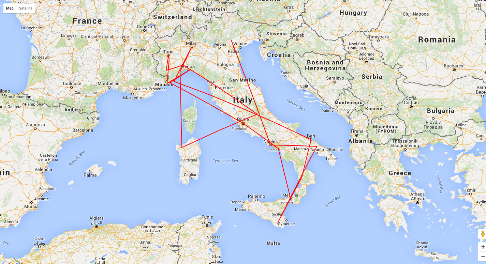

# TSP resolved with a genetic algorithm

This project is related to
[https://github.com/wdalmut/tsp-genetic-algorithm](https://github.com/wdalmut/tsp-genetic-algorithm)

In my first attempt i try to find a solution minimizing the path from a point
to another one using a natural selection and recombination based on an incomplete
travel solution (wrong...).

In this proposal i try to solve using different complete solution sets and i try
to optimize them using mutation and recombination effects for a fixed number of
consecutive generations.

 * mutations and recombination occurs at 50% rate.
 * i don't select "individuals" (solutions) that are more probable to be an
   optimized solution (shortest - for produce a better generation) but just
   randomly (uniform distribution)...

The solution proposed is not optimized and the fact that mutations,
recombination and selections are not correctly configured causes a set of useless
solutions as canditates for new generations and sadly a terrible final solution...

